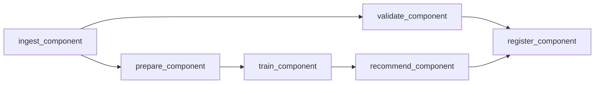

# recommendation-system-kubeflow

## Português

`recommendation-system-kubeflow` é um projeto que simula um pipeline de recomendação com a mentalidade de `Kubeflow Pipelines`, separando ingestão, validação, preparação da matriz usuário-item, treino, geração de recomendações e registro final.


### Como pensar um pipeline de recomendação com Kubeflow

Em um desenho mais próximo de produção, Kubeflow entra para resolver quatro problemas importantes:

- separar responsabilidades por componente;
- permitir reexecução parcial de etapas;
- tornar artefatos intermediários visíveis e reutilizáveis;
- preparar o pipeline para escalar em ambiente Kubernetes.

Este MVP simula exatamente essa mentalidade. A lógica algorítmica foi mantida propositalmente simples para que o foco do repositório fique na estrutura do workflow:

- `ingest_component`
  materializa as tabelas base;
- `validate_component`
  checa volume e estatísticas básicas;
- `prepare_component`
  transforma interações em matriz usuário-item;
- `train_component`
  calcula a estrutura de similaridade;
- `recommend_component`
  produz recomendações batch;
- `register_component`
  persiste o relatório consolidado.

### Componentes

- [src/data_factory.py](src/data_factory.py)
  gera os datasets de usuários, itens e interações e os persiste em `data/raw/`;
- [src/components.py](src/components.py)
  implementa os componentes lógicos do pipeline;
- [src/pipeline_runner.py](src/pipeline_runner.py)
  executa o DAG localmente em ordem determinística;
- [pipeline.py](pipeline.py)
  escreve a especificação declarativa da DAG estilo Kubeflow;
- [main.py](main.py)
  runner consolidado do projeto;
- [tests/test_pipeline.py](tests/test_pipeline.py)
  valida o contrato mínimo do pipeline.

### DAG



### Contrato de saída

O pipeline gera um relatório consolidado com:

- `runtime_mode`
- `validation`
  estatísticas básicas do corpus de entrada;
- `recommendations_path`
  caminho do CSV batch com recomendações;
- `top_recommendations`
  amostra das recomendações geradas;
- `report_artifact`
- `pipeline_spec_artifact`

Além disso, o projeto persiste:

- `data/raw/users.csv`
- `data/raw/items.csv`
- `data/raw/interactions.csv`
- `data/processed/user_item_matrix.csv`
- `data/processed/recommendations.csv`
- `data/processed/kubeflow_recommendation_report.json`
- `artifacts/kubeflow_pipeline_spec.json`

### Resultados atuais

- `runtime_mode = local_kubeflow_style_pipeline`
- `user_count = 5`
- `item_count = 10`
- `interaction_count = 15`
- `mean_rating = 4.0667`

Exemplos de recomendações geradas:

- `U-1001 -> stroller (family) | score = 2.4259`
- `U-1002 -> entry_phone (budget) | score = 1.9407`
- `U-1003 -> headphone (tech) | score = 1.3809`

### Observações de implementação

- O projeto usa similaridade usuário-usuário para manter a lógica do modelo simples e explicável.
- A etapa de recomendação filtra itens já consumidos e remove scores nulos antes de montar o ranking final.
- O foco principal do repositório é a orquestração por componentes, não a sofisticação algorítmica do recomendador.
- O artefato `kubeflow_pipeline_spec.json` não executa Kubeflow de fato, mas documenta a DAG e ajuda a posicionar o projeto como `Kubeflow-ready`.

### Execução

```bash
python3 main.py
python3 -m unittest discover -s tests -v
python3 -m py_compile main.py pipeline.py src/data_factory.py src/components.py src/pipeline_runner.py
```

## English

`recommendation-system-kubeflow` simulates a recommendation pipeline with a `Kubeflow Pipelines` mindset, separating ingestion, validation, user-item matrix preparation, training, batch recommendation, and final registration into explicit components.


### How to think about a Kubeflow recommendation pipeline

In a production-oriented design, Kubeflow helps solve four recurring problems:

- component isolation;
- partial re-execution;
- artifact visibility and reuse;
- portability to Kubernetes-based ML workflows.

This MVP mirrors that logic through explicit local components for ingestion, validation, matrix preparation, similarity computation, batch recommendation, and registration.

### Output contract

- `runtime_mode`
- `validation`
- `recommendations_path`
- `top_recommendations`
- `report_artifact`
- `pipeline_spec_artifact`

### Current results

- `runtime_mode = local_kubeflow_style_pipeline`
- `user_count = 5`
- `item_count = 10`
- `interaction_count = 15`
- `mean_rating = 4.0667`

Example recommendations:

- `U-1001 -> stroller (family) | score = 2.4259`
- `U-1002 -> entry_phone (budget) | score = 1.9407`
- `U-1003 -> headphone (tech) | score = 1.3809`
