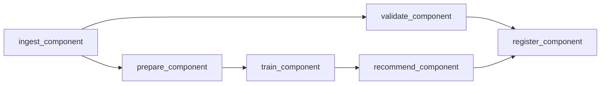

# recommendation-system-kubeflow

## Português

`recommendation-system-kubeflow` é um projeto que simula um pipeline de recomendação com a mentalidade de `Kubeflow Pipelines`, separando ingestão, validação, preparação da matriz usuário-item, treino, geração de recomendações e registro final.

### Storytelling técnico

Sistemas de recomendação raramente são só um modelo isolado. Em produção, eles precisam de uma esteira que materialize interações, transforme esses sinais em estruturas reutilizáveis, gere recomendações e publique artefatos de forma reexecutável. Em ecossistemas como Kubeflow, essa esteira vira uma DAG orquestrada em Kubernetes, com componentes independentes e contratos explícitos.

Este projeto foi desenhado para mostrar essa lógica de forma local e reproduzível. A implementação usa uma abordagem simples de similaridade usuário-usuário, mas organiza o fluxo como um pipeline real:

- ingestão das tabelas base;
- validação do volume e consistência;
- preparação da matriz usuário-item;
- cálculo da similaridade;
- geração batch de recomendações;
- registro dos resultados.

### Componentes

- [src/components.py](/Users/flaviagaia/Documents/CV_FLAVIA_CODEX/recommendation-system-kubeflow/src/components.py)
- [src/pipeline_runner.py](/Users/flaviagaia/Documents/CV_FLAVIA_CODEX/recommendation-system-kubeflow/src/pipeline_runner.py)
- [pipeline.py](/Users/flaviagaia/Documents/CV_FLAVIA_CODEX/recommendation-system-kubeflow/pipeline.py)
- [main.py](/Users/flaviagaia/Documents/CV_FLAVIA_CODEX/recommendation-system-kubeflow/main.py)
- [tests/test_pipeline.py](/Users/flaviagaia/Documents/CV_FLAVIA_CODEX/recommendation-system-kubeflow/tests/test_pipeline.py)

### DAG


```

### Resultados atuais

- `runtime_mode = local_kubeflow_style_pipeline`
- `user_count = 5`
- `item_count = 10`
- `interaction_count = 15`
- `mean_rating = 4.0667`

Exemplos de recomendações geradas:

- `U-1001 -> stroller (family) | score = 2.4259`
- `U-1002 -> entry_phone (budget) | score = 1.9407`
- `U-1003 -> headphone (tech) | score = 1.3809`

### Observações de implementação

- O projeto usa similaridade usuário-usuário para manter a lógica do modelo simples e explicável.
- A etapa de recomendação filtra itens já consumidos e remove scores nulos antes de montar o ranking final.
- O foco principal do repositório é a orquestração por componentes, não a sofisticação algorítmica do recomendador.

### Execução

```bash
python3 main.py
python3 -m unittest discover -s tests -v
python3 -m py_compile main.py pipeline.py src/data_factory.py src/components.py src/pipeline_runner.py
```

## English

`recommendation-system-kubeflow` simulates a recommendation pipeline with a `Kubeflow Pipelines` mindset, separating ingestion, validation, user-item matrix preparation, training, batch recommendation, and final registration into explicit components.

### Current results

- `runtime_mode = local_kubeflow_style_pipeline`
- `user_count = 5`
- `item_count = 10`
- `interaction_count = 15`
- `mean_rating = 4.0667`

Example recommendations:

- `U-1001 -> stroller (family) | score = 2.4259`
- `U-1002 -> entry_phone (budget) | score = 1.9407`
- `U-1003 -> headphone (tech) | score = 1.3809`
